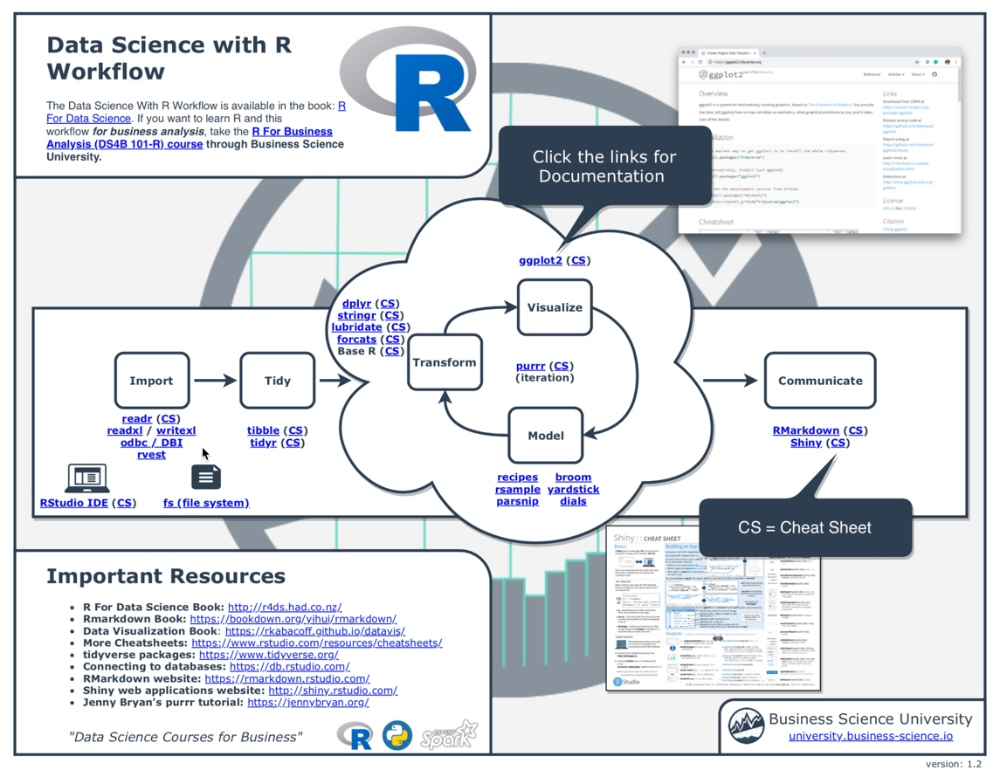

# 什么是商业智能

- [商业智能](https://baike.baidu.com/item/%E5%95%86%E4%B8%9A%E6%99%BA%E8%83%BD/406141?fromtitle=BI&fromid=4579902) (Business Intelligence, 简称: BI), 又称商业智慧或商业智能. 

利用计算机工具, 对**企业或者组织机构的业务历史数据进行分析**, 获取为企业或组织机构管理者, **决策时**所需要的的知识信息的过程和方法.

本课程主要介绍商业智能三大技术核心:

- [数据仓库](https://baike.baidu.com/item/%E6%95%B0%E6%8D%AE%E4%BB%93%E5%BA%93) (Data Warehouse, DW)
- [联机分析处理](https://baike.baidu.com/item/%E8%81%94%E6%9C%BA%E5%88%86%E6%9E%90%E5%A4%84%E7%90%86) (Online Analytical Processing, OLAP)
- [数据挖掘](https://baike.baidu.com/item/%E6%95%B0%E6%8D%AE%E6%8C%96%E6%8E%98/216477) (Data Mining)

商业智能的关键是从许多来自不同的企业运作系统的数据中提取出有用的数据并进行清理, 以保证数据的正确性, 然后经过抽取 (Extraction)、转换 (Transformation) 和装载 (Load), 即 ETL 过程, 合并到一个企业级的数据仓库里, 从而得到企业数据的一个全局视图, 在此基础上利用合适的查询和分析工具、数据挖掘工具、OLAP工具等对其进行分析和处理（这时信息变为辅助决策的知识）, 最后将知识呈现给管理者, 为管理者的决策过程提供支持。

# 主流BI工具

# 使用 `R` 进修数据分析流程

# `R` 与 `RStudio` 的安装

- `R` 下载: https://www.r-project.org/
- `RStudio` 下载: https://rstudio.com/

# 扩展阅读

- [6 Reasons To Learn R For Business](https://www.business-science.io/business/2017/12/27/six-reasons-to-use-R-for-business.html)
- [R and Python: How to Integrate the Best of Both into Your Data Science Workflow](https://www.business-science.io/business/2018/10/08/python-and-r.html)
